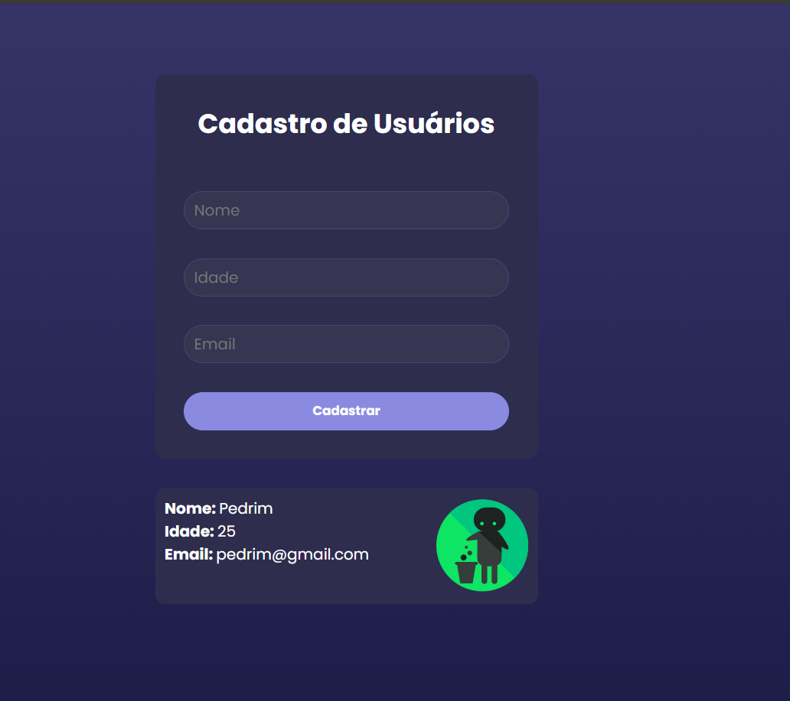
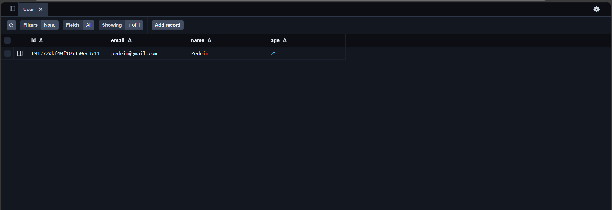

# Trabalho_Desenvolvimento_Web_React#
Tela simples de **cadastro de usuários** com integração a uma API RESTful utilizando **MongoDB Atlas**. Permite adicionar, visualizar e excluir usuários, com validação de e-mail duplicado.

## 🚀 Funcionalidades

- Cadastro de usuário com nome, idade e e-mail
- Listagem de usuários cadastrados
- Exclusão de usuários por ID
- Validação de e-mail duplicado com mensagem de erro: `usuário já cadastrado!`

## 🛠️ Tecnologias utilizadas

- **Front-end**: React, HTML, CSS, JavaScript
- **Back-end**: Node.js, Express
- **Banco de dados**: MongoDB Atlas
- **Ferramentas**: VS Code, Prisma Studio, Postman

## 📦 Como rodar o projeto

1. Clone o repositório:
   ```bash
   git clone https://github.com/MatheusSchwhartz/Trabalho_Desenvolvimento_Web_React.git
2. Instale as dependências:
   cd projeto-dev-react
   npm install
3. Inicie o servidor e abra o Prisma Studio (opcional para visualizar o banco):
   node server.js
   npx prisma studio
4. Inicie o front-end:
   cd projeto-react-dev
   npm run dev

## 🖼️ Capturas de tela

### Tela de cadastro


### Banco de cadatro dos Clientes

   


   
